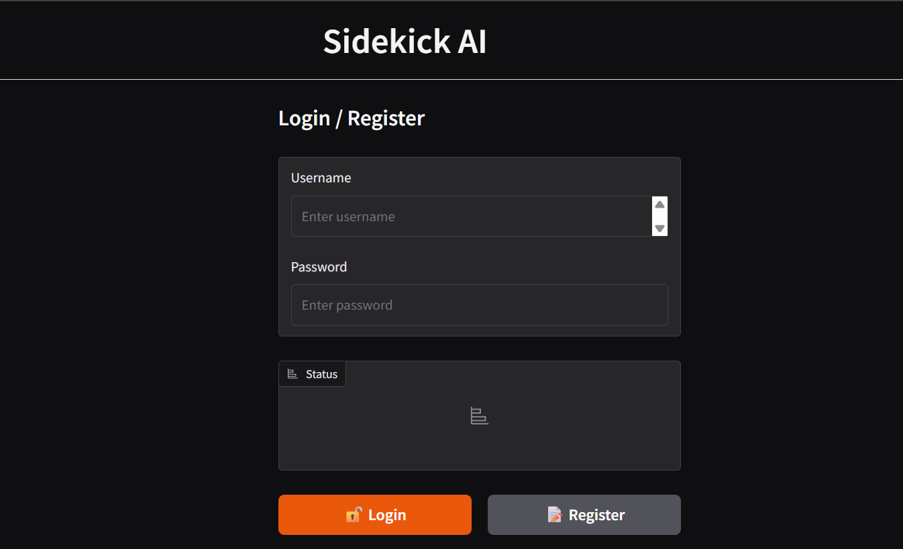
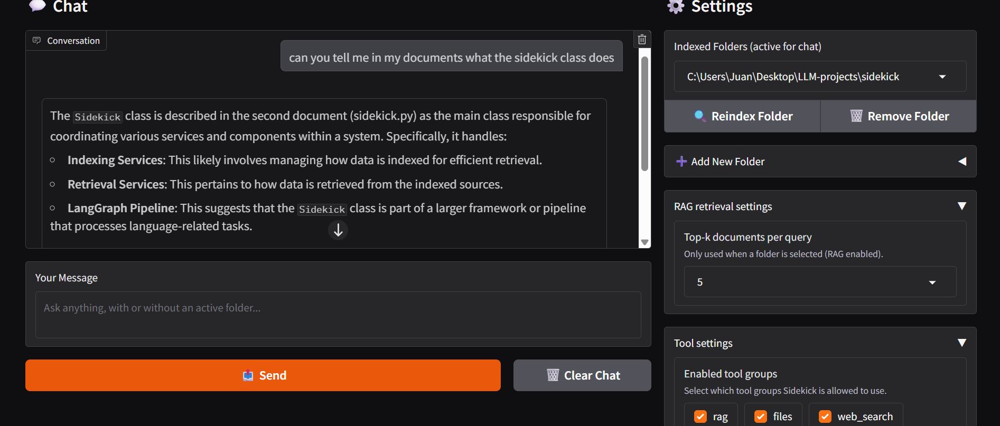

# SidekickAI

## Introduction
Sidekick is a personal AI assistant designed to enhance productivity by integrating advanced language model capabilities into everyday workflows. It helps users organize knowledge, automate tasks, and interact with information through structured, persistent conversations.

The project is built as a practical, extensible system that combines Large Language Models (LLMs), Retrieval-Augmented Generation (RAG), and agent-based workflows.

## Key Concepts
- Each Knowledge Base folder has its own dedicated chat.
- Every indexed folder represents an independent context and conversation.
- Chats are isolated per folder, preventing context mixing.
- This design allows users to work on multiple topics or projects in parallel.
- Chats and folders are persistent and can be resumed at any time.

## Screenshots

<p align="center">
  
  <br/>
  <strong>Login page</strong>
</p>

---

<p align="center">
  
  <br/>
  <strong>Main page</strong>
</p>

## Demo Video

Click the image below to watch a full demo of **SidekickAI** on YouTube.

[](https://youtu.be/BiodhwA6oEg)


## Models and AI Stack
- Chat Model: `gpt-4o-mini`  
  Chosen to reduce costs while maintaining strong reasoning and tool usage.
- Embedding Model: `text-embedding-ada-002` via OpenAI API.  
  Used for semantic indexing and retrieval inside knowledge base folders.
- Frameworks:
  - LangGraph for agent orchestration and workflow control.
  - LangChain ecosystem tools for retrieval, tools, and integrations.

## Features
- Contextual understanding using LLMs.
- Knowledge Base per folder, each with its own chat history.
- Persistent chats saved per user and per folder.
- User authentication with private settings and conversations.
- Customizable indexing with adjustable chunk size and overlap.
- Configurable retrieval count per query.
- Modular tool-based agent system.
- Clean and extensible LangGraph-based architecture.
- Supported file types for indexing:
  - PDF (.pdf)
  - Markdown (.md)
  - Plain text (.txt)
  - Python source files (.py)
- The indexing pipeline is designed to be easily extensible to support additional file formats.

## Important Note About RAG
RAG (Retrieval-Augmented Generation) is implemented as **one of Sidekick’s tools**, not a mandatory step.

- RAG is only used when it is **enabled** and when the agent decides it is **useful/necessary** for a given prompt.
- If RAG is disabled (via tool settings) or if no folder/file context is selected, Sidekick will answer using the LLM and any other enabled tools.
- This keeps the agent flexible: it can work as a general assistant, or as a knowledge-base assistant, depending on the session configuration.

## Why It Matters
Managing multiple contexts and information sources is difficult in fast-paced environments. Sidekick reduces cognitive load by keeping knowledge bases and chats clearly separated while automating repetitive tasks and information retrieval.


## Installation
### Clone the repository from GitHub

```bash
git clone https://github.com/Jsrodrigue/sidekickAI.git
cd sidekickAI
```

### Option 1: Using venv and requirements.txt
```bash
python -m venv .venv
source .venv/bin/activate
pip install -r requirements.txt
```

(On Windows, activate with \`.venv\\Scripts\\activate\`)

### Option 2: Using uv and pyproject.toml
This project supports uv for fast dependency management.

```bash
uv venv
uv sync
```


## Usage

1. Create an account.
2. Log in to your workspace.
3. Create or select a Knowledge Base folder.
4. Chat with Sidekick inside the selected folder.

### Run the application

After installing dependencies, start the application using one of the following options:

#### Option 1: Using Python directly

Make sure your virtual environment is activated:

```bash
python app.py
```

#### Option 2: Using uv

```bash
uv run app.py
```

The application will start locally and you can access it through the URL shown in the terminal.


## Configuration Settings
Each Knowledge Base can be configured independently:
- Chunk Size: controls how documents are split during indexing.
- Chunk Overlap: improves context continuity across chunks.
- Retrieval Count: number of documents retrieved per query.

## Example .env File
OPENAI_API_KEY=your_openai_api_key_here  
SERPER_API_KEY=your_serper_api_key_here  


## LangGraph Architecture Overview
Sidekick uses a LangGraph-based agent loop with a single worker node and a tool execution node.

The graph is designed to be simple, deterministic, and extensible.

### Nodes
- Worker node  
  - Main LLM node with tools bound  
  - Builds a dynamic system prompt using:
    - Success criteria (if provided)
    - Current timestamp
    - Tool usage constraints
  - Decides whether tools are needed based on the model output

- Tool node  
  - Executes tool calls emitted by the worker  
  - Supports multiple tool invocations per turn (with safety limits)

### Control Flow
1. START → Worker
2. Worker decides:
   - If tool calls are present → Tools
   - If not → END
3. Tools → Worker (loop continues)
4. Worker → END when no further tool calls are needed

### Key Design Decisions
- Tool usage is conditional and bounded per turn.
- Disabled tools are respected at runtime.
- The worker node is stateless beyond the shared graph state.
- Memory is injected via a checkpointer to persist conversations per folder.
- **RAG is treated as a tool**: it can be enabled/disabled and is not always invoked.

This design makes the graph easy to extend with:
- Additional decision nodes
- Specialized workers
- Validation or guardrail steps
- Multi-agent routing in the future

## How It Works (High Level)
1. The user sends a message in a selected Knowledge Base folder (or without any folder).
2. The LangGraph worker node processes the input.
3. If RAG is enabled and applicable, relevant documents are retrieved.
4. Tools are invoked only when necessary (based on model decisions and enabled tool settings).
5. The response is generated and saved to the folder-specific chat.

## Tools
Sidekick exposes multiple tool groups. Any tool can be enabled/disabled at runtime, and the agent only uses tools when needed:
- **RAG (Retrieval-Augmented Generation)** for document-based answering (optional tool, not always invoked).
- File tools for reading, writing, and listing files.
- Web search for external information.
- Python execution for dynamic tasks.
- Wikipedia integration for quick factual lookups.
- LangGraph for coordinating agent workflows.

## Inspiration and Educational Context
This project was inspired by the Udemy courses "AI Engineer Core Track: LLM Engineering, RAG, QLoRA, Agents" and "AI Engineer Agentic Track: The Complete Agent & MCP Course" by Ed Donner.

It was developed as a portfolio project to demonstrate practical skills in:
- LLM-based automation
- Agent design
- Retrieval systems
- Tool orchestration

## License
This project is licensed under the MIT License. See the LICENSE file for details.
